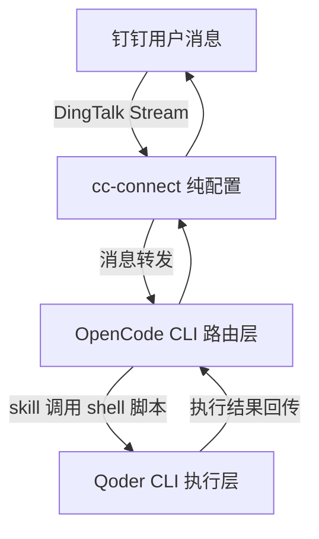

# 🤖 cc-connect-router

> 通过钉钉远程控制本地开发环境：**OpenCode 作为轻量路由层，Qoder CLI 作为真实执行层**。

在钉钉里发一句话，就能让本地的 Qoder CLI 帮你查任务、派活、看进度、跑代码。基于 [cc-connect](https://github.com/chenhg5/cc-connect) 搭建，无需编写任何自定义后端代码 —— 全部通过配置 + skill + shell 脚本完成。

---

## 🏗️ 架构

```
钉钉 → cc-connect → OpenCode (路由) → Skill + 脚本 → Qoder CLI (执行)
```

```
              钉钉用户消息
                   │  DingTalk Stream
                   ▼
        ┌──────────────────────┐
        │      cc-connect       │   纯配置，无自定义代码
        └──────────────────────┘
                   │  消息转发
                   ▼
        ┌──────────────────────┐
        │     OpenCode CLI      │   轻量路由层（skill 理解意图）
        └──────────────────────┘
                   │  skill 调用 shell 脚本
                   ▼
        ┌──────────────────────┐
        │      Qoder CLI        │   真实执行层
        └──────────────────────┘
                   │  执行结果回传
                   ▼
     OpenCode ──► cc-connect ──► 钉钉
```

用 Mermaid 表示：



---

## 📦 安装

```bash
npm install -g cc-connect-router
```

安装后即可使用 `cc-router` 命令行工具。

---

## 🚀 快速开始

```bash
# 1. 初始化配置（在 ~/.cc-connect-router/config.toml 生成默认配置）
cc-router init

# 2. 配置钉钉凭证
cc-router config set projects.0.platforms.0.options.client_id "your-id"
cc-router config set projects.0.platforms.0.options.client_secret "your-secret"

# 3. 设置项目工作目录
cc-router config set projects.0.agent.options.work_dir "/path/to/project"

# 4. 启动服务
cc-router start
```

其中钉钉凭证 `client_id` / `client_secret` 需在[钉钉开放平台](https://open.dingtalk.com)创建**企业内部应用**（或机器人应用），并在「机器人」配置中启用 **Stream 模式**后获取。

---

## 🧩 Skill 安装（面向 Agent 用户）

如果你使用支持 [skills.sh](https://skills.sh) 的 Agent，可以直接安装本仓库提供的 `qoder-router` skill：

```bash
npx skills add huangtengxiao/connect/skill/qoder-router
```

这会把 `qoder-router` skill（含意图路由规则、shell 脚本、参考文档）安装到你的 Agent 中，让 Agent 具备识别钉钉消息意图并调用 Qoder CLI 的能力。

---

## 📖 CLI 命令参考

| 命令 | 说明 |
|------|------|
| `cc-router init [--force]` | 初始化配置目录与默认配置文件（`--force` 覆盖已存在文件） |
| `cc-router config get <key>` | 读取配置项（支持点号路径） |
| `cc-router config set <key> <value>` | 修改配置项（自动类型推断） |
| `cc-router config remove <key> [--yes]` | 删除配置项（`--yes` 跳过确认） |
| `cc-router config list` | 显示完整配置（敏感字段遮掩） |
| `cc-router project add <name> <dir> [--agent type]` | 添加新项目 |
| `cc-router project remove <name> [--yes]` | 删除项目 |
| `cc-router project list` | 列出所有项目 |
| `cc-router start` | 使用当前配置启动 cc-connect |

---

## 💬 使用示例

在钉钉中直接用自然语言对机器人说：

| 你发送的消息 | 路由到的脚本 | 作用 |
|--------------|--------------|------|
| 查看 connect 项目的任务 | `qoder-tasks.sh` | 列出项目后台任务 |
| 给 cli 项目指派任务：优化命令行参数解析 | `qoder-assign.sh` | 创建新任务 |
| 看看任务 abc123 的执行进度 | `qoder-status.sh` | 查询会话状态 |
| 在 opencode 项目中实现日志模块 | `qoder-exec.sh` | 立即执行指令 |
| 任意开发问题（如"帮我看下这个报错"） | `qoder-exec.sh`（默认路由） | 交给 Qoder 处理 |

> 意图识别与参数提取由 `skill/qoder-router/SKILL.md` 定义的路由规则完成。

---

## 📂 项目结构

```
connect/
├── bin/
│   └── cli.js                   # cc-router CLI 入口
├── src/
│   ├── commands/                # 各子命令实现（init/get/set/start 等）
│   ├── lib/                     # 配置存取与路径工具
│   └── index.js
├── templates/
│   └── config.default.toml      # 默认配置模板（cc-router init 使用）
├── skill/
│   └── qoder-router/            # skills.sh 标准格式 skill
│       ├── SKILL.md             # skill 定义：意图识别 + 路由规则
│       ├── scripts/             # skill 附带的 shell 脚本
│       └── references/          # 参考文档（如 setup-guide.md）
├── scripts/                     # 本地脚本（开发者模式使用）
│   ├── common.sh                # 公共函数库
│   ├── qoder-tasks.sh           # 查询项目任务列表
│   ├── qoder-assign.sh          # 指派新任务
│   ├── qoder-status.sh          # 查询会话/任务状态
│   └── qoder-exec.sh            # 在项目中执行指令
├── config.toml                  # 本地开发参考配置
├── Makefile                     # setup / run / check 等命令
├── package.json
└── README.md
```

---

## ➕ 添加新项目

```bash
cc-router project add my-backend /path/to/backend --agent qoder
```

添加后可用 `cc-router project list` 查看，无需手动编辑配置文件。

---

## 🛠️ 开发者模式（可选）

如果你直接在本仓库开发调试，也可以使用手动配置方式：

1. 直接编辑本地 `config.toml`，填入钉钉凭证与 `work_dir`。
2. 运行 `make run` 启动服务（会优先使用 `~/.cc-connect-router/config.toml`，若不存在则回退到本地 `config.toml`）。

其他常用命令：

```bash
make install      # 设置 scripts/*.sh 可执行权限
make check        # 检查环境依赖与配置
make test-local   # 本地测试脚本可用性
```

---

## 📋 前置条件

| 依赖 | 说明 | 链接 |
|------|------|------|
| **Node.js >= 18** | 运行 `cc-router` CLI 所需 | https://nodejs.org |
| **cc-connect** | 消息网关，把钉钉消息转发到本地 Agent | https://github.com/chenhg5/cc-connect |
| **OpenCode CLI** | 轻量路由层，理解意图并调用脚本 | https://opencode.ai |
| **Qoder CLI** | 真实执行层，命令名 `qodercli` | — |
| **钉钉开发者账号** | 需在开放平台创建机器人，获取 `client_id` / `client_secret` | https://open.dingtalk.com |

> macOS 使用 `--timeout` 功能需额外安装 coreutils：`brew install coreutils`。

---

## 🔧 故障排查

| 问题 | 可能原因 & 解决方法 |
|------|--------------------|
| **cc-connect 连接失败** | 检查配置中 `client_id` / `client_secret` 是否正确；确认钉钉应用已开启 **Stream 模式**；确认本机能访问外网。 |
| **qodercli 未找到** | 脚本会报 `[ERROR] 未找到 'qodercli' 命令`。请确认 Qoder CLI 已安装并在 `PATH` 中；或用环境变量 `QODER_CLI` 指定可执行文件名。 |
| **钉钉消息收不到** | 确认机器人已加入群聊 / 开启单聊；服务是否在运行；查看前台日志有无报错。 |
| **任务执行超时** | 对耗时操作加 `--timeout <秒>` 参数；macOS 需先 `brew install coreutils` 才能使用 timeout 功能。 |
| **脚本无执行权限** | 运行 `make install` 为 `scripts/*.sh` 添加可执行权限。 |
| **找不到配置文件** | 运行 `cc-router init` 生成 `~/.cc-connect-router/config.toml`。 |

排查前可先跑一遍 `make check` 确认依赖与配置状态，再用 `make test-local` 验证脚本能否正常调用。

---

Made with ❤️ · 让开发像发消息一样简单。
