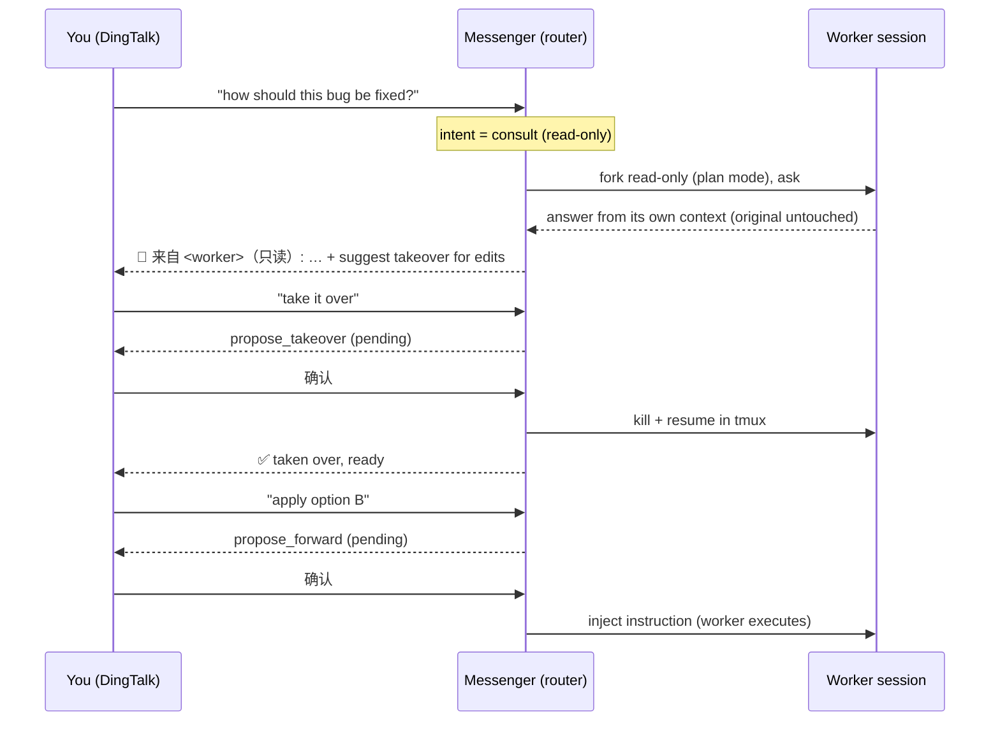

# 🤖 agent-connect

**English** | [简体中文 (README.zh-CN.md)](./README.zh-CN.md)

> Monitor and control **multiple** coding-agent sessions (Claude Code / qodercli) running on your machine — straight from DingTalk on your phone. **Read/write split · one-to-many · messenger agent for intent dispatch · human-confirmed writes.**

📖 **Intro site:** https://xinyuehtx.github.io/agent-connect/

Send one message in DingTalk to see the status of every agent session on your machine, pull results read-only, and inject follow-up instructions into a specific task. A lightweight **messenger agent** (built on the Vercel AI SDK, any OpenAI-compatible model) reads your intent, decides read vs. write, and targets the right session — every mutation of a worker session waits for **your confirmation**. Messages ride [cc-connect](https://github.com/chenhg5/cc-connect) for DingTalk ⇄ local transport; a companion `agent-connect serve` provides a web console.

---

## 🏗️ Architecture

Three layers, one job each:

- **Messenger Agent (dispatch, not a re-router)** — built on the AI SDK, decoupled from Claude Code. It only decides *read vs. write / which session / which verb* and calls the control plane via tools; **the task itself still runs in the worker agent.** The messenger keeps its own conversation context (shared by web + DingTalk) and **never enters a worker's context** — that's what makes read/write separation work for natural-language input.
- **Read / write planes** — reads (list/read) only touch Claude Code's on-disk session registry and transcripts: zero side effects, never the worker process. Writes (send/takeover/run) go through tmux, gated by a **propose → confirm → execute** state machine.
- **Transport** — still cc-connect. Because cc-connect only accepts custom programs through its `acp` agent type, the messenger plugs in as a thin **ACP bridge** (`agent-connect acp`) that forwards to the `agent-connect serve` daemon.

```
DingTalk ─Stream─► cc-connect ─exec─► agent-connect acp (bridge) ─HTTP─► agent-connect serve (daemon)
                                                                        │
   ┌─────────────────────────────────────────────────────────────────┐ │
   │  Web console + SSE + config       gate (allowlist / prefix / confirm) │◄┘
   │        │  shared conductor / pending / messenger context           │
   │  AgentConductor  ( propose → confirm → execute )                   │
   │  Messenger Agent ( AI SDK, OpenAI-compatible )                     │
   │        │  read tools  /  propose tools                             │
   │  ControlPlane: listSessions·getMessages · sendMessage·takeover·run │
   └──┬──────────────────┬──────────────────┬─────────────────────────┘
   registry.js       transcript.js         tmux.js
```

> **Evolution:** earlier versions argued for “no routing agent” (forward chat straight to the worker, let it interpret). But controlling other sessions from chat that way **pollutes the worker's context** and lacks a safety gate. The current design uses a separate messenger for **addressing/dispatch** (it never re-interprets or re-executes the task) plus plane separation plus human confirmation — keeping the “just say it” UX while staying safe.

---

## 📦 Install

**One-click (recommended)** — installs the CLI + cc-connect, checks Node/tmux, runs `agent-connect init`:

```bash
curl -fsSL https://raw.githubusercontent.com/xinyuehtx/agent-connect/main/scripts/install.sh | bash
```

<sub>Skip the gateway with `AC_SKIP_CC=1`, skip init with `AC_SKIP_INIT=1`.</sub>

**Or via npm:**

```bash
npm install -g @tengxiaohtx/agent-connect
```

**Or from a GitHub Release** (offline / pinned) — grab the `.tgz` from [Releases](https://github.com/xinyuehtx/agent-connect/releases):

```bash
npm install -g https://github.com/xinyuehtx/agent-connect/releases/download/v1.3.10/agent-connect-1.3.10.tgz
```

## 🚀 Quick start

```bash
# 1. Create default config at ~/.agent-connect/config.toml
agent-connect init

# 2. Start the web console daemon (prints an access token on first run)
agent-connect serve
#   Open http://127.0.0.1:8787 → log in with the printed token
#   Settings → LLM Provider: base_url / api_key / model (any OpenAI-compatible endpoint)
#   Settings → IM connector: DingTalk client_id / client_secret + gate (prefix / allowlist)

# 3. In another terminal, start cc-connect (DingTalk ⇄ local)
agent-connect start
```

Everything is configurable via CLI too (equivalent to the settings page):

```bash
agent-connect config set messenger.base_url "https://your-gateway/v1"
agent-connect config set messenger.api_key  "sk-..."
agent-connect config set messenger.model    "gpt-4o-mini"
agent-connect config set projects.0.platforms.0.options.client_id     "your-dingtalk-client-id"
agent-connect config set projects.0.platforms.0.options.client_secret "your-dingtalk-client-secret"
```

DingTalk credentials come from an **internal app / bot** on the [DingTalk Open Platform](https://open.dingtalk.com) with **Stream mode** enabled. The default config already wires the messenger as cc-connect's `acp` agent (`cmd = "agent-connect"`, `args = ["acp"]`) — no manual edit needed.

> In DingTalk, messages need the `/ai` prefix to reach the messenger (e.g. `/ai list sessions`). Reply `确认`/`取消` (yes/no) to a pending action. The prefix is configurable, or leave it empty to process every message.

---

## 🧠 Messenger agent (manager router)

The messenger is a **manager router**, not a worker. It only does *intent recognition + routing*; the real work runs in the target worker session. It keeps a **current-session pointer (like a shell `cwd`)** so follow-ups don't need to name a session.

**Intents / tools**
- `switch_current` — set the current session (cwd). `list_sessions` — list all (project / agent / status / latest input).
- `consult_session` — **read-only consult**: asks the worker *itself* and **never mutates the original**. Two modes by size:
  - *small session* → **full-fork** (`--resume --fork-session` + read-only) — accurate, full context.
  - *large session* → **bounded-excerpt** — feeds a **fresh** agent an excerpt **starting from the latest compaction summary** (`isCompactSummary` / `compact_boundary`) + subsequent messages (falls back to the recent tail if never compacted). Avoids replaying a huge transcript (a 14 MB session went from 90 s+ timeout → ~12 s); answer is labeled *lossy*.
  - read-only is enforced per agent: Claude `--permission-mode plan`; **qoder `--tools ""`** (disables all tools — stronger than a permission mode; `--yolo` is the opposite and is only used for *control*, never consult). Desktop apps (qwen / qoderwork) have no CLI → consult unsupported (use `read_reply`).
  - Used for "why / how to fix / summarize / explain".
- `read_reply` — latest reply of the current session. `snapshot_session` — render its terminal pane to an image.
- `propose_forward` / `propose_takeover` / `propose_exit` / `propose_run` — **staged**, require your "确认".

**Guarantees**
- **Read/write split**: consult & reads are read-only (fork or transcript); only `propose_*` mutate, and only after confirmation.
- **Stale-cwd gate**: before any write it checks the current session is alive; if gone it clears the pointer and tells you to re-`switch_current`.
- **Source attribution**: replies mark who's speaking — the messenger (`🧭`) vs. a worker (`> 🔁 来自 <name·agent>（只读）`). Worker output is never passed off as the messenger's.
- **Read-only → takeover**: if a read-only consult concludes an edit is needed, the messenger recommends **takeover** (switch that session to edit mode) instead of writing into a read-only context.

The LLM uses the Vercel AI SDK — **openai-compatible / openai / anthropic** (`anthropic` supports `auth_style: bearer` for gateways). Configure via the web settings page or config file; decoupled from Claude Code.

### How a request flows



### Example chat

```
你 ▸ 列出会话
🧭 信使 ▸ | 状态 | 短ID | 名称 | 项目 | 最近输入 |
          | 🔄 | 5122982b | connect-console | connect | … |
          | ✅ | c233caaf | agentmon | agentmon | … |

你 ▸ 切到 c233caaf
🧭 信使 ▸ 📍 已切到 agentmon（c233caaf）

你 ▸ 它最近完成了什么？          # 咨询 → 只读 fork
🧭 信使 ▸ > 🔁 来自 agentmon·claude（只读）：发布了 v0.6.0，换成极光罗盘猫……

你 ▸ 帮我把版本号改成 0.6.1       # 需要改动 → 建议接管
🧭 信使 ▸ 这需要编辑，建议先接管进入编辑模式。要我提议接管吗？
你 ▸ 接管 → 确认                  # propose_takeover → 执行
🧭 信使 ▸ ✅ 已接管 c233caaf，已在 tmux 就绪
你 ▸ 改好后跑一下测试 → 确认       # propose_forward → 注入 worker 执行
```

---

## 🖥️ Web console (`agent-connect serve`)

Open `http://127.0.0.1:8787`. The token is optional — leave `web.token` empty for open localhost access, or set one to require login. Three views:

- **Board** — every session as a card (status · project · agent · last input) with 详情 / 接管 / 退出 actions. **Running / waiting sessions are pinned to the top**; a **recency filter** (1 / 3 / 7 days) hides old completed tasks — and the same setting applies to IM `list_sessions`. Live via SSE (≈1.2 s).
- **Session detail** — one worker's message stream (user / assistant / tool calls) updating live; send / takeover / exit from here.
- **Messenger** — chat with the router; shows the **📍 current-session** badge and a **pending-confirmation** card (confirm / cancel) shared with DingTalk.

**Settings** (gear icon): the **LLM provider** (provider / base_url / api_key / model / auth_style) and the **IM connector** (DingTalk client_id/secret + gate prefix/allowlist) — same values as the config file, secrets masked. Changes take effect live (no restart).

```
┌ Board ────────────────────────────┐   Detail / Messenger
│ 🔄 connect-console  claude·connect │   → click a card for the
│ ⏳ agentmon         claude·agentmon│     session's live stream,
│ ✅ website-fe       claude·website │     or the 信使 tab to chat
└───────────────────────────────────┘     with the router
   [已完成任务范围: 近 3 天 ▾]  + 新建  刷新
```

---

## 🌐 Any IM (not just DingTalk)

Because cc-connect bridges **many platforms** (DingTalk, Feishu, Telegram, Slack, Discord, WeChat Work, QQ, LINE…), and our messenger plugs in as its platform-agnostic `acp` agent, agent-connect works with **any of them**. The ACP bridge reads the platform from cc-connect's `CC_SESSION_KEY` and applies the matching gate.

To add an IM:
1. Configure that platform in the cc-connect side of `~/.agent-connect/config.toml` (its own `[[projects.platforms]]` + credentials — see cc-connect docs).
2. (Optional) Add a gate for it: `[im.platforms.<name>]` with `enabled` / `command_prefix` / `allowed_sender_ids` / confirm words. If omitted, defaults apply (enabled, empty allowlist = allow all).

The messenger, read/write planes, and confirm gate are identical across platforms — only the transport differs.

## 📇 Access control & clear denials

When a sender isn't in `allowed_sender_ids`, the bot **replies with an explicit “not authorized” message** (instead of silence), telling you which ID to add. Empty allowlist = allow all. The sender ID is whatever the platform reports (e.g. DingTalk `senderStaffId`).

## 🧵 Threaded replies (command quoting)

Every reply to a command is prefixed with a compact quote of the command that triggered it (`> 🗨️ 你：list sessions`), so you always know which message a reply answers — even when several commands are in flight and answers arrive out of order. DingTalk has **no native quote-reply through cc-connect** (`reply_to_trigger` is Feishu-only), so this is done in the reply content and works on every platform. Turns are also **serialized per conversation**, so overlapping commands can't race the shared messenger context or arrive out of order. Toggle with `im.platforms.<name>.quote_reply` (default `true`).

## 🌐 Reply language & auto-translation

The messenger replies in a configurable language (default **Chinese**; `messenger.reply_language`, or **Settings → LLM Provider → 回复语言**). When a **worker's reply** comes back in a different language, the messenger translates it once and **appends the translation after the original**, so you always see both — e.g. an English agent answer arrives with a `🌐 信使译文（中文）` block beneath the original. Same-language replies are detected and left untranslated (no extra call); translation failures degrade silently to the original. Supported: zh / en / ja / ko / fr / es / de / ru / pt / it.

## ⏳ Recency filter (web + IM)

To avoid drowning in old tasks, completed sessions are filtered by age: `[filter] window_days` (1 / 3 / 7, or `0` = all). **Running / waiting sessions are always shown**; only idle/exited ones older than the window are hidden. The web board has a dropdown that persists this, and the **same setting applies to IM `list_sessions`**, so the messenger won't surface stale tasks either.

## 🔔 Proactive notifications

The daemon pushes an IM message on only two transitions — **needs confirmation/input** (a session enters `waiting`) and **task done** (`busy → idle`) — deduped per session with a cooldown. **Monitor-only GUI agents (qwen / qoderwork) are excluded by default**: you drive those in their own app and can't act on them remotely, so their completions would just be noise. Set `notify.monitor_only = true` to include them. Config: `[notify]` `enabled` / `on_needs_confirm` / `on_task_done` / `cooldown_ms` / `monitor_only` / `scope`.

## 🖌️ Streaming AI card (DingTalk, optional)

For a typewriter-style streaming reply, create an **AI card template** on the DingTalk Open Platform and set its id — `card_template_id` (+ optional `card_template_key`, `card_throttle_ms`) under the DingTalk platform options, or via the web **Settings → IM connector → Streaming AI card**. If unset, replies fall back to normal messages (fully functional, just not streamed).

## 📸 Rich replies & screenshots

Replies are sent as **Markdown** (tables, bold, code blocks, emoji status), so the session list shows project / agent / status / latest input at a glance. The messenger can also send **images**: `snapshot_session` renders a session's terminal pane to a PNG (via headless Chrome, auto-detected; set `messenger.chrome_path` to override) and posts it to the chat; `send_image` delivers any local image file. Both go out via `cc-connect send --image`. If no renderer is found, snapshots fall back to a Markdown code block.

---

## 📖 CLI reference

| Command | Description |
|---------|-------------|
| `agent-connect init [--force]` | Create config dir + default config (`--force` overwrites) |
| `agent-connect serve [-H host] [-p port]` | Start web console + messenger daemon (planes + gate; prints token on first run) |
| `agent-connect acp` | ACP bridge for cc-connect (spawned by cc-connect; don't run by hand) |
| `agent-connect start` | Start cc-connect (DingTalk ⇄ local transport) |
| `agent-connect config get/set/remove/list` | Read/write config (dot-path keys, sensitive fields masked) |
| `agent-connect project add/remove/list` | Manage cc-connect projects |
| `agent-connect agent list [-a] [--json]` | List running agent sessions |
| `agent-connect agent read <id> [--full]` | Read status + latest reply (read-only, no pollution) |
| `agent-connect agent send <id> "<text>"` | Inject an instruction into a tmux session |
| `agent-connect agent takeover <id> [--force]` | Adopt a non-tmux session (kill + resume in tmux) |
| `agent-connect agent run ["<prompt>"] [-w dir]` | Spawn a new remote-controllable session in tmux |

---

## 📋 Prerequisites

| Dependency | Purpose | Link |
|------------|---------|------|
| **Node.js ≥ 18** | Runs the `agent-connect` CLI and `serve` daemon | https://nodejs.org |
| **cc-connect** | Gateway; forwards DingTalk to the messenger via `acp` | https://github.com/chenhg5/cc-connect |
| **OpenAI-compatible LLM** | The messenger's model (`base_url` + `api_key` + `model`) | self-hosted gateway / proxy |
| **tmux** | Needed for the write plane; reads don't need it | `brew install tmux` |
| **Claude Code / qodercli** | The worker agents being controlled (at least one) | — |
| **DingTalk developer account** | Create a bot, get `client_id`/`client_secret`, enable Stream mode | https://open.dingtalk.com |

## 🛠️ Development

```bash
npm test            # node --test
node bin/cli.js --help
```

## 📂 Layout

```
src/lib/control-plane.js   read/write planes (reuses registry/transcript/tmux)
src/lib/messenger/         agent (AI SDK) / conductor / provider / pending / history
src/lib/im/                gate (routing) / session-key (CC_SESSION_KEY parsing)
src/server/                Fastify: http / routes / sse / auth  (web + /im/handle)
web/                       console front-end
docs/                      GitHub Pages intro site
```

## License

MIT

